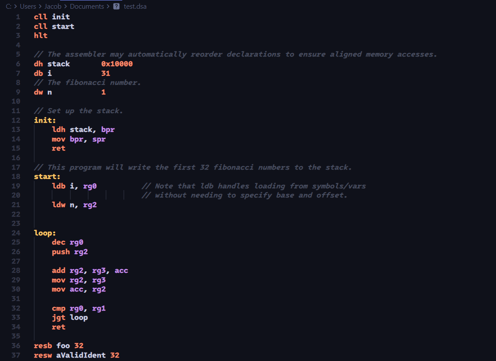

# dsa-language-support

Adds support for the DSA assembly language in VSCode.

## Features

- Basic syntax highlighting

## Known Issues

We don't have any language server yet so semantic highlighting won't work yet.

## Release Notes

### 0.1.0

- Basic syntax highlighting using TextMate grammar.
